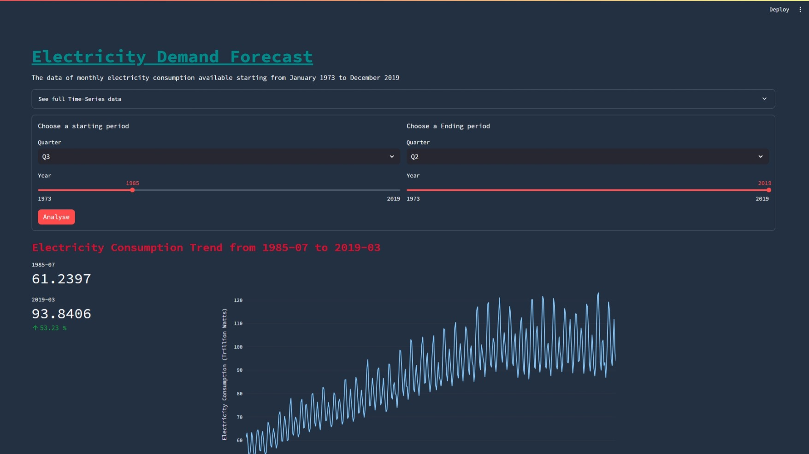
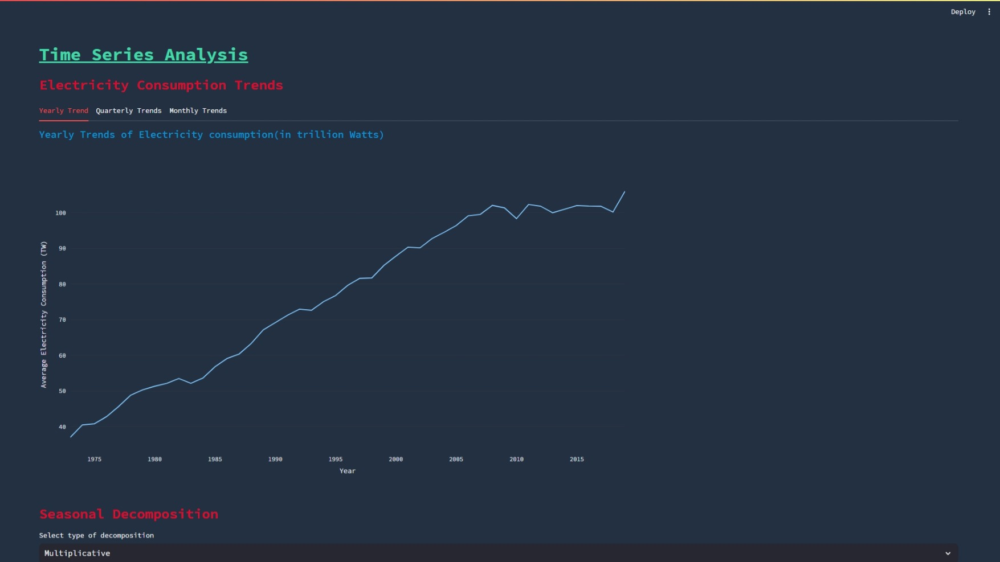
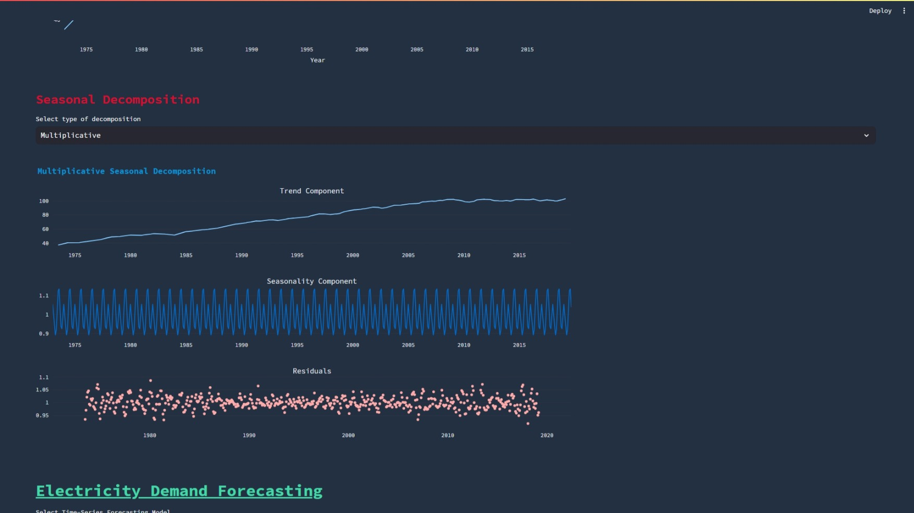
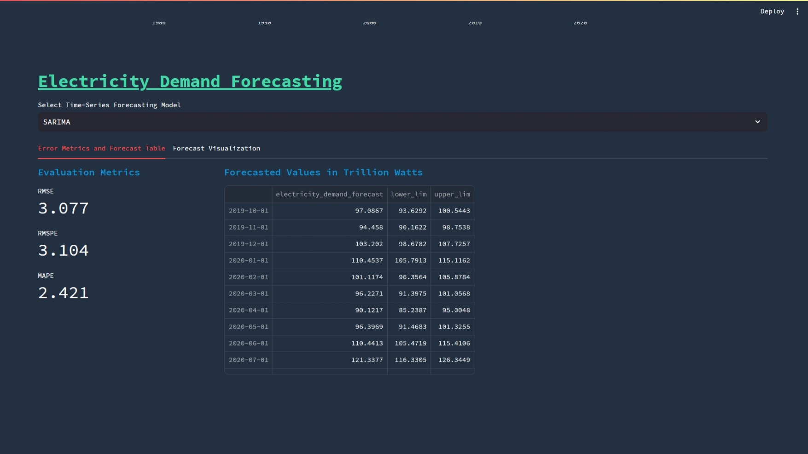
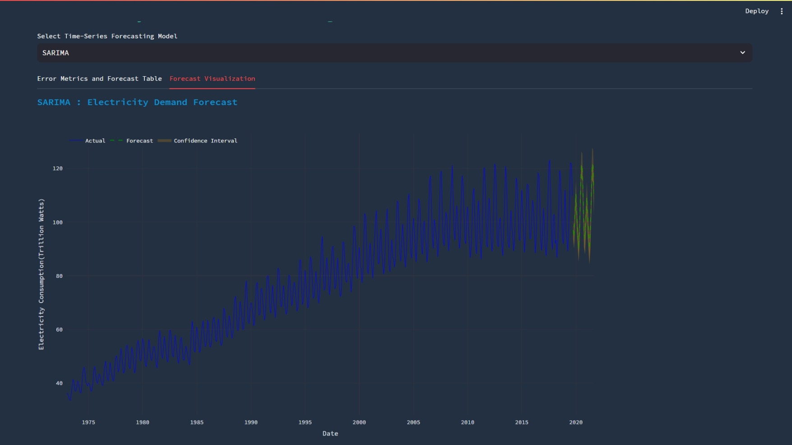

# Electricity Demand Forecasting

The aim of this project is to gain insights into the demand for electricity over the next 1-2 years. This information is crucial for effectively managing electricity production and coordinating with vendors. Accurate demand estimation is essential for optimizing electricity procurement or production.

## Available Data

The dataset includes monthly electricity consumption data from January 1973 to December 2019. The key variables are:

1. **Date**: Month & Year
2. **Electricity Consumption**: Electricity consumption in Trillion Watts

## Business Objective

The primary objectives are as follows:

a. **Demand Forecasting**: Forecast the demand for electricity for the next 1-2 years.

b. **Error Metrics Calculation**: Calculate error metrics, including RMSE (Root Mean Square Error), RMSPE (Root Mean Square Percentage Error), and MAPE (Mean Absolute Percentage Error).

c. **Model Comparison**: Compare various models, such as Decomposition, ETS (Error, Trend, Seasonality) models, ARIMA/SARIMA (AutoRegressive Integrated Moving Average/Seasonal ARIMA) Models with various parameters, etc.

d. **Streamlit web application** : We build a Streamlit web application  for time series analysis and forecasting. The app is designed to provide users with an interactive interface to explore time series data, perform analysis, and generate forecasts.

## Screenshots

**Electricity consumption trend with Interactive dropdowns and sliders to select a time window  for analysis**

**Yearly, Quarterly and Monthly Trends for Time Series data with interactive plots.**

**Seasonal Decomposition of Time Series data with dropdown to select 'Additive' or 'Multiplicative'**

**Evaluation Metric for selected Model and Display Forcasted Values in Table**

**Visualise Forecasted values for selected Model**

## Conclusion

The successful completion of this project will enable the electricity distribution company to make informed decisions based on accurate electricity demand forecasts, contributing to efficient production and resource management.
